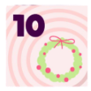
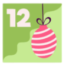
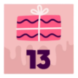
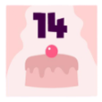
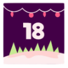
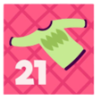
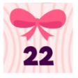
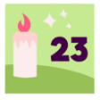
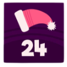
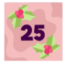

# Advent of Code

My solution of Advent Of Code puzzles in Kotlin. The aim is to have clear and readable code that executes in reasonable time.

## 2015

<i>See details</i>

### 50 ⭐ / 50 ⭐

 

 

 

 

- 2015
- 2016
- 2017
- 2021
- 2022
- 2023
- 2024