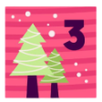
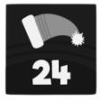
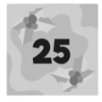

# Advent of Code

My solution of Advent Of Code puzzles in Kotlin. The aim is to have clear and readable code that executes in reasonable
time.

## 2024 - 50 ⭐

<i>See details</i>

 

 

 

 

## 2023 - 50 ⭐

<i>See details</i>

 

 

 

 

## 2022 - 50 ⭐

<i>See details</i>

 

 

 

 

## 2021 - 50 ⭐

<i>See details</i>

 

 

 

 

## 2017 - 38 ⭐

<i>See details</i>

 

 

 

<picture></picture> 
<picture></picture>
<picture></picture>
<picture></picture>
<picture></picture>
<picture></picture>

## 2016 - 50 ⭐

<i>See details</i>

 

 

 

 

## 2015 - 50 ⭐

<i>See details</i>

 

 

 

 

